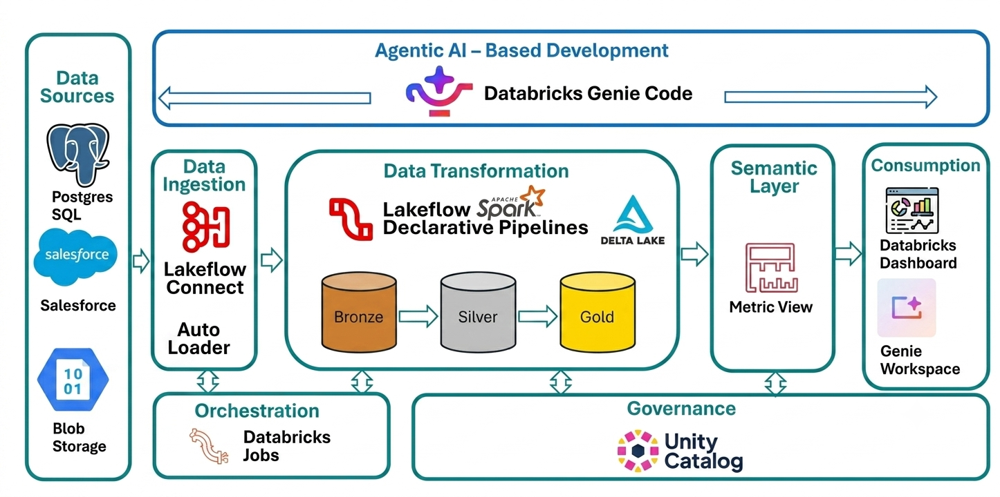

# Building a Smart Retail Data Platform Using Medallion Architecture on Databricks

## 1. Project Overview (Executive Summary)

This project aims to build a comprehensive, automated, and scalable data pipeline using the **Databricks** platform. The project relies on the **Medallion Architecture (Bronze, Silver, Gold)** to ingest data from multiple, diverse sources (databases, CRM systems, and cloud files), then clean it, standardize it, and apply Data Quality rules to it, so that it becomes ready for advanced analytics and insight extraction in the Gold layer.


## 🏗️ 2. Data Architecture (Medallion Architecture)
=


### A. Extraction Layer (Bronze Layer - Raw Data)

* **Goal:** Receiving raw data from sources exactly as it is, without modification.
* **Sources and Ingestion Mechanisms:**
1. **Postgres Database:** Pulled using a ready-made Pipeline (LakeFlow Connect).
2. **Salesforce System (Accounts and Opportunities data):** Pulled as streaming data.
3. **CSV Files (Transactions data):** Stored in Blob Storage and pulled using **Auto Loader** technology to handle Incremental Data.


---
+## 📁 Project Structure
+
+```
+retail-data-platform-databricks/
+│
+├── databricks.yml              # Main bundle configuration
+├── .gitignore
+├── README.md
+├── LICENSE
+├── requirements.txt
+│
+├── resources/                  # Bundle resource definitions
+│   ├── jobs/
+│   │   └── retail_job.yml
+│   │
+│   ├── pipelines/
+│   │   ├── postgres_ingestion.yml
+│   │   ├── salesforce_ingestion.yml
+│   │   └── retail_transformation.yml
+│   │
+│   ├── dashboards/
+│   │   └── executive_retail_analytics.md
+│   │
+│   └── permissions/
+│       └── permissions.yml
+│
+├── src/                        # Source code
+│   ├── notebooks/
+│   │   ├── bronze/
+│   │   │   └── blob_to_bronze.py
+│   │   ├── silver/
+│   │   ├── gold/
+│   │   │   ├── gold_views.sql
+│   │   │   └── calendar.sql
+│   │   ├── semantic/
+│   │   │   └── retail_metrics.sql
+│   │   └── dashboard/
+│   │
+│   ├── pipelines/
+│   │   ├── bronze_to_silver/
+│   │   │   ├── product_catalog.py
+│   │   │   ├── inventory.py
+│   │   │   ├── account.py
+│   │   │   └── opportunity.py
+│   │   └── silver_to_gold/
+│   │       └── fact_sales.py
+│   │
+│   ├── sql/
+│   ├── python/
+│   └── utils/
+│
+├── tests/                      # Test suites
+│
+└── docs/                       # Documentation
+    ├── Architecture.md
+    ├── Deployment.md
+    ├── Troubleshooting.md
+    └── Dashboard_Recreation.md

---

## 2. Infrastructure and Technologies (Architecture & Tech Stack)

The latest technologies in the cloud environment were adopted to ensure efficiency and scalability:

* **Core Platform:** Databricks.
* **Governance & Access Management:** Unity Catalog.
* **Processing Engine:** Apache Spark (PySpark).
* **Transformation Framework:** LakeFlow Spark Declarative Pipelines / Delta Live Tables (DLT).
* **Data Ingestion Tools:** Databricks LakeFlow Connect & Auto Loader (`cloudFiles`).


This project was designed to build an integrated End-to-End Cloud Data Platform based on the Medallion Architecture within the **Databricks** environment. The project aims to integrate sales and transaction data from multiple sources, clean it, model it, and make it ready for natural language queries using AI technologies (Databricks Genie AI).

---

### B. Cleansing and Standardization Layer (Silver Layer - Cleansed Data)

* **Goal:** Applying Data Quality standards and cleaning text.
* **Tools:** Using the `pyspark.pipelines` library (DLT).
* **Key Code Transformations:**
* **Text Cleaning:** Using `F.trim` and `F.upper` functions to standardize text.
* **Null Handling:** Converting empty strings `""` into `None` (NULL) using `F.when`.
* **Data Quality Rules (Expectations):**
* `@dp.expect_or_drop`: To delete completely invalid records (such as a missing product ID `id IS NOT NULL`).
* `@dp.expect`: To allow the record to pass through while logging an alert in the quality system (such as validating the launch date).
* **Feature Engineering:** Creating new columns such as `deal_size` to classify deal sizes into (ENTERPRISE, MID_MARKET, SMALL) based on sales values.

### C. Business and Reporting Layer (Gold Layer - Star Schema)

* **Goal:** Modeling the data to be ready for BI Tools with the fastest possible performance using the **Star Schema**.
* **Engineering Design of the Layer:**
1. **`fact_sales` Fact Table (Physical Table):**
* Built by merging (LEFT JOIN) the `transactions` table with the `opportunity` table using the `opportunity_name` key.
* Stored as a physical table due to it containing complex calculations and merges.
2. **`dim_customer` and `dim_product` Dimension Tables (Views):**
* Designed as Views using SQL to save storage space (Storage Optimization), since the data is already unified in the Silver layer.
* Filters for active records `WHERE is_deleted = false AND is_active = true` were applied to handle Slowly Changing Dimensions (SCD Type 2).
3. **`dim_calendar` Calendar Table (GenAI Generated):**
* Fully generated using **Databricks Genie**.
* Contains advanced SQL functions such as `explode(sequence(...))` to create a time sequence, and extracting complex business details (such as `is_weekend` and `is_last_day_of_month`).

---

## 🧠 3. Semantic Layer & Metric Views

* **Goal:** Building a "Single Source of Truth" to unify concepts and calculation formulas and prepare the platform for AI.
* **Implementation:** Using the **Metric Views** feature, written in **YAML** combined with SQL.
* **Components of the Metric View (`retail_metrics`):**
* **Source:** The `fact_sales` table.
* **Joins:** Predefined definitions linking the fact table to the dimension tables (products, customers, calendar).
* **Measures:** Definitions of calculation formulas such as total revenue `SUM(amount)`, and the count of distinct customers `COUNT(DISTINCT customer_id)`. Formats were configured to display them as currency (USD) or as integers.
* **Dimensions:** Defining descriptive columns while adding a **Synonyms** feature (such as linking the term `sale date` to `Transaction Date`) to make it easier for the AI engine to understand managers' questions.

---

## 📊 4. Consumption Layer

User interfaces suited to every management level were designed:

1. **Lakeview Dashboards:**
* Read data directly from the Semantic Layer to automatically inherit all formats and formulas.
* Include an (Executive Overview) with Key Performance Indicators (KPIs), sales trends over time, and product performance analysis.
2. **Genie Spaces:**
* A Conversational UI that allows managers to ask questions in plain English (such as: *"Which customer is doing max transactions?"*).
* Genie translates the question into complex SQL, executes it against the Gold tables, and returns the answer along with an illustrative chart. Settings (Instructions & Benchmark queries) were configured to ensure the accuracy of responses and their validity for a production environment (Production-ready).

---

## ⚙️ 5. Orchestration & DataOps

All the previous parts were connected to work as a synchronized automated system using **Databricks Jobs**.

* **Workflow Name:** `retail Q end to end job`
* **Task Sequence (DAG Dependencies):**
1. Fetching Postgres data.
2. Fetching Salesforce data.
3. Fetching Blob Storage data (by running a Notebook file).
4. Running the transformation pipelines (Silver & Gold ETL) conditioned on the dependency (`depends_on`) on the success of all extraction tasks.
5. Refreshing the dashboard (Dashboard Refresh).
* **System Resiliency Settings:**
* **Retries:** The system was configured to retry 4 times in case any task fails.
* **Scheduling:** Tasks are scheduled to run periodically using Cron Syntax.
* **Notifications:** Email notifications enabled for cases of success, failure, or delay.

This platform was designed and built as part of developing an advanced cloud infrastructure. The project focuses on applying DataOps best practices, writing clean and efficient PySpark code, and designing scalable engineering database systems in Cairo's tech environment to serve advanced business intelligence goals.
